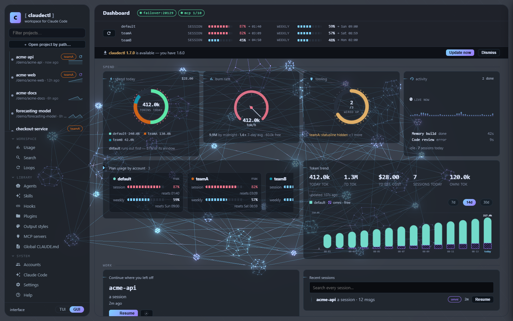
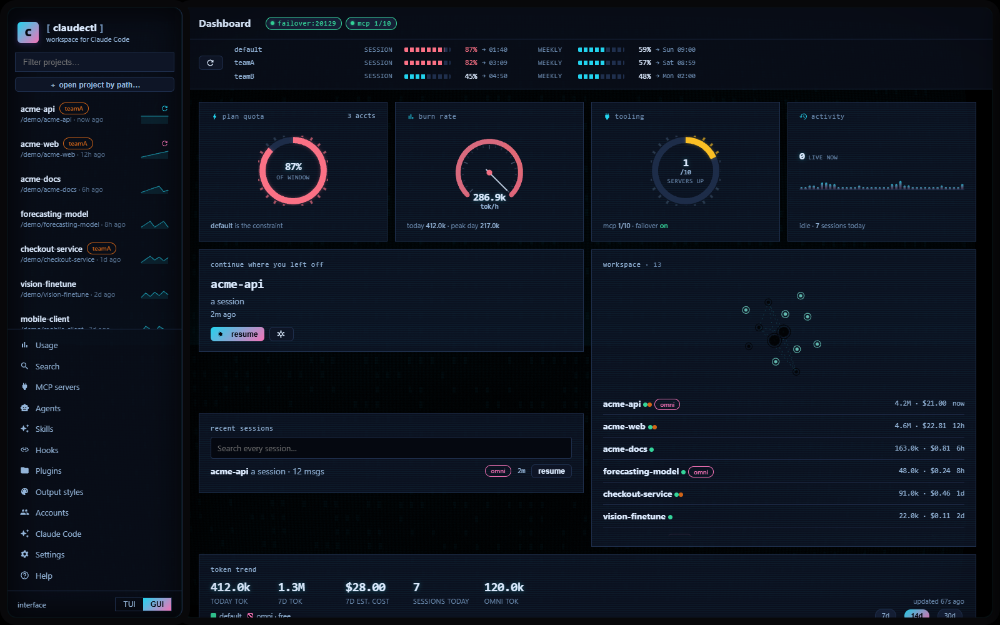

# Desktop GUI

`claudectl --gui`.

Everything the terminal UI does, as a native desktop app — full feature parity, served
locally (loopback-only, works offline). No Python dependencies; the browser bundle vendors
three.js and anime.js (both MIT, served from `/vendor/`, never a CDN).

{ width="900" }

- **Shells** — PyQt6 native window if installed, else an Edge app-mode window, else the browser (`gui_shell` setting: auto / qt / edge / browser). The bottom-left toggle (or `ui_mode`) picks which interface starts by default; `--tui`/`--gui` always override.
- **Projects & sessions** — sidebar with live filter and quick-resume; per-session resume / fork / rename / tag / archive / restore / delete / export markdown / transcript with session info / changed files.
- **Launch modal** — effort, model, permission mode, account, thinking cap, subagent model, session name, worktree — as one-click chips, prefilled from your defaults. Sessions open in a real new console window.
- **Project tabs** — Memory (build / ask / recall preview / lessons review / workspace status, with **live scan progress**), CLAUDE.md (view / scaffold / AI analyze / AI compress / prune / edit + memory files map + system prompt), Audit (context weight + deny rules), Usage, **Plan → Execute** (plan model + effort, execute via Anthropic or free OmniRoute, full explanation inline), Tools (inject context from any session/account, project agents picker mirroring the TUI's category multi-select with suggestions, extra PATH entries, `--add-dir` directories), and the architecture Graph.
- **Managers** — MCP servers, agent library + AI-generate, hooks + AI-generate, accounts — same operations as the TUI, with the same diff-approval gate for AI-written files (jobs run server-side, you approve a git-style diff before anything is written).
- **Usage banner** — one live bar-row per account (session/weekly/model windows with reset times), auto-refreshes every minute, refresh button for an immediate re-fetch.
- **Stacked toasts** — multiple simultaneous notifications (errors, success, info) stack instead of overwriting; each auto-dismisses after 3.5 seconds. Job failures show the error message rather than a generic "Failed".
- **Job cancel** — running background jobs (plan generation, memory build, review) show a Cancel button; the `cancelled` flag is cooperative (checked at loop top, no thread kill).
- **Persistent preferences** — theme and account selection saved to `localStorage`, restored across page reloads.
- **Editable Plan → Execute** — the generated plan appears in a monospace textarea for inline editing before approval; "Re-plan" sends feedback to regenerate; "Per-step approval" gates execution step by step. Every generated plan is auto-saved.
- **Skills / Worklog / Review / model-routing panels** — Skills manager, worklog toggle + entry history, one-click code review (working diff or staged-only), and OmniRoute free-tier configuration.

Icons are inline Material SVG — no CDN, no emoji.

## Themes: 29 palettes, 7 skins, 4 themed worlds

A **palette** answers "what colours" — 29 of them, authored as real hex (Catppuccin, Tokyo
Night, Gruvbox, Rosé Pine, Nord, Solarized and more), applied verbatim to every surface
rather than derived from an accent hue. A **skin** answers "what is this app": corner
treatment, border weight, type scale, row density, chassis frame, card entrance and which
background scene runs. The two are orthogonal — pick both, or let the palette choose its
default skin. Live preview before saving.

A **world** commits to a whole look instead: it owns its palette, skin, background scene,
icon set, overlay and cursor together, and disables the palette/skin pickers while worn.
Four ship — `anime`, `cyber`, `deck` and `graph`, the last an homage to claudectl's own
[architecture graph](graph.md).

The background is a single full-viewport scene driven by real state (running jobs,
navigation, today's burn), capped and calmed by design, and it stops five ways — hidden tab,
blurred window, `motion:off`, `stage:off`, or `prefers-reduced-motion`. Set `stage: lite`
(or `off`) if your hardware struggles.

## Setup

The Edge and browser shells need nothing extra. For the native window, see
[GUI setup](install.md#gui-setup).

The GUI is a local HTTP server on loopback with a per-run secret; the routes it exposes are
documented in the [API reference](api.md).
