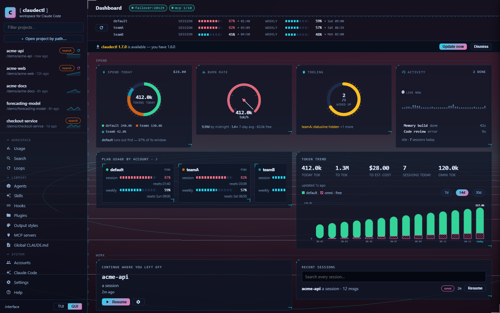
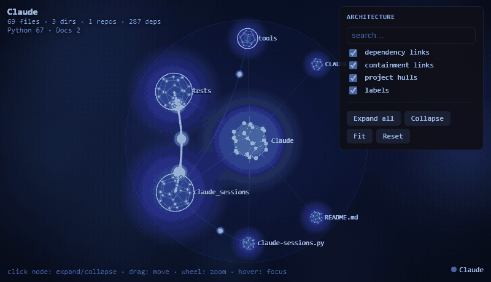
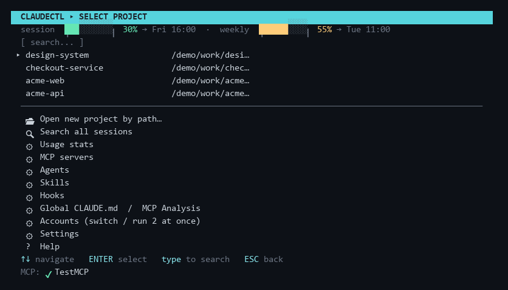
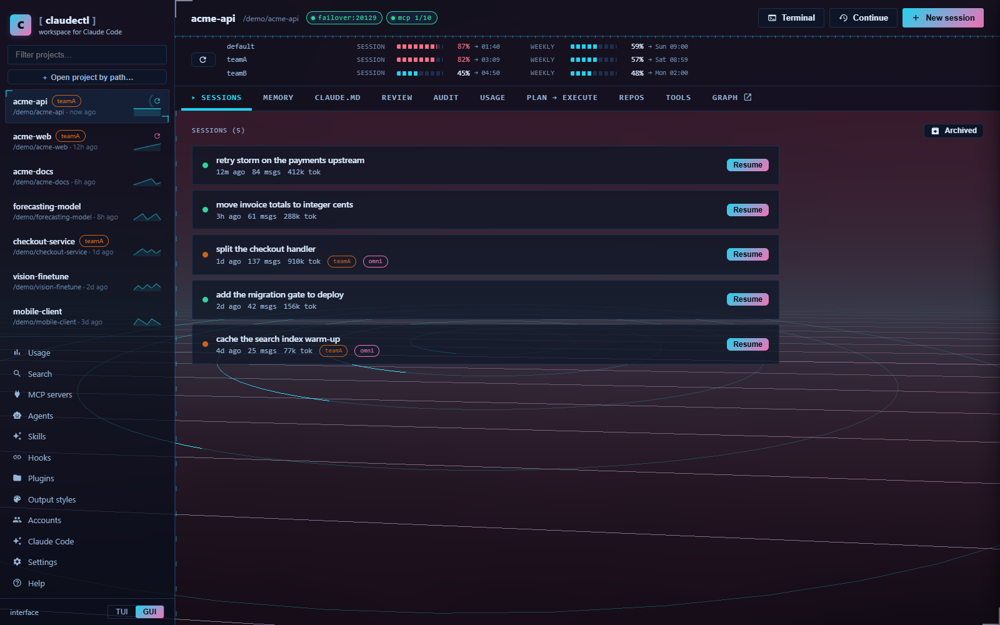

# The workspace layer for Claude Code

Claude Code is excellent inside a session and forgetful between them. Every new session
starts from nothing, old sessions are hard to find, and the only way to give the agent
context is a `CLAUDE.md` that grows until it costs more than it is worth.

**claudectl sits in front of Claude Code and fixes that.** Pick a project, see every
session you have ever had in it, and launch with the model, effort, permissions and
context you meant. Underneath, it maintains a semantic memory of the codebase and injects
only the part relevant to what you just asked.

It is a terminal UI and a desktop GUI over the same engine — use whichever you prefer.

{ width="900" }

[Install it](install.md){ .md-button .md-button--primary }
[See what it does](features.md){ .md-button }

## Why claudectl

- **Intelligent memory, not a memory dump** — task-scoped, token-budgeted injection at the
  launcher: a micro-index always on (≤250 tokens), per-module detail loaded only when
  Claude touches those files, and an optional per-prompt hook that injects just the
  subgraph relevant to what you asked.
- **It learns from every session** — durable lessons distilled from transcripts,
  human-reviewed, injected when relevant, decayed when stale.
- **See your architecture** — an animated, expandable dependency graph that opens at the
  project level and drills down to single files.
- **Auto-solves common Claude Code pain** — pre-launch health checks, context-loss
  insurance after `/compact`, permission-fatigue killer, token-burn advisor, daily usage
  tracking.
- **Workspace, not chats** — browse, search, tag, fork, resume and archive every session
  across every project and account.
- **Zero runtime dependencies** — pure Python standard library; uses your existing Claude
  Code auth.

## How it saves tokens

Without claudectl a big project either starves the agent or floods it. claudectl spends the
minimum tokens for the maximum relevant context:

| | |
|---|---|
| **Flat always-on cost** | The `CLAUDE.md` block is a ≤250-token index, not a full dump, and does not grow as the codebase grows. |
| **On-demand detail** | Per-module knowledge lives in path-scoped `.claude/rules/`, loaded only when Claude touches those files. |
| **Task-scoped injection** | The optional prompt hook injects only the subgraph your prompt needs, budgeted to ≤600 tokens. |
| **No stale weight** | Superseded facts are invalidated, dead entities evicted. |
| **Cheaper model for grunt work** | Plan → Execute runs the expensive model once for the plan and a cheap one for execution. |

[Read the token economy →](token-economy.md)

## The architecture graph

{ width="820" }

A self-contained interactive HTML view of your project's real dependency structure, opened
straight from the session browser. [More →](graph.md)

## Find what you need

| | |
|---|---|
| [Install](install.md) | pipx, pip, checkout, the Claude Code plugin, GUI setup |
| [Usage](usage.md) | every screen, every key binding, the command line |
| [Features](features.md) | one page per area — the whole surface at a glance |
| [Project memory](memory.md) · [Architecture graph](graph.md) · [Plan → Execute](plan-execute.md) | the three things nothing else does |
| [Context hand-off](context-handoff.md) | resume a full session in a new one — or under another account, when one runs out |
| [Multiple accounts](accounts.md) · [MCP servers](mcp.md) · [Agents & skills](agents.md) · [Hooks](hooks.md) | Claude Code integration |
| [Desktop GUI](gui.md) · [Status line & failover](statusline.md) | the two interfaces and what runs under them |
| [Token economy](token-economy.md) · [Project health](health.md) | spend less, break less |
| [Reference](reference.md) · [API reference](api.md) | where everything is stored, and every HTTP route |
| [FAQ](faq.md) · [Compare](compare.md) · [Troubleshooting](troubleshooting.md) | honest answers, including what it does *not* do |

## Terminal or desktop, same engine

[Full feature list](features.md){ .md-button }
[Frequently asked questions](faq.md){ .md-button }
