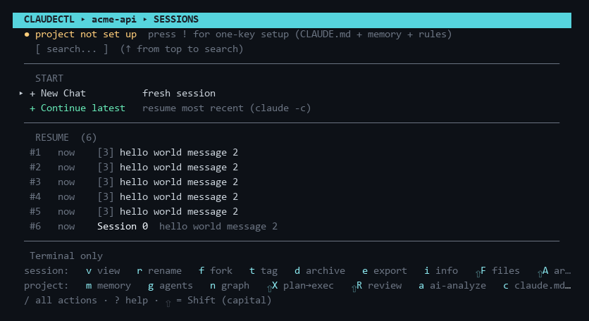

# Usage

## Main screen

On launch, claudectl shows all projects Claude Code has ever opened, sorted by most recently
used.

- Quick-resume items appear at the top (★ = most recent session, ☆ = older sessions). These are the 5 most recently used sessions across all projects; selecting one resumes that exact session without navigating into the project's list.
- All other projects follow, sorted by recency — type to filter live
- The MCP status footer shows connected MCP servers once the background check completes
- Bottom menu: **🔍 Search all sessions**, **⚙ Usage stats**, **⚙ MCP servers**, **⚙ Agents**, **⚙ Hooks**, **⚙ Global CLAUDE.md**, **⚙ Settings**, **? Help**

## Built-in screens

**🔍 Search all sessions** — indexes session names, AI titles, and previews across every
project (cached — instant after the first scan). Type to filter, ENTER resumes the selected
session directly, no matter which project it belongs to.

**⚙ Usage stats** — per-project table of sessions, messages, tokens (in / out / cache) and
estimated API-equivalent cost, parsed from local transcripts. ENTER drills into per-session
rows. Costs are estimates at published API rates — useful as a value/consumption gauge if
you're on a subscription plan. First scan shows progress and can be stopped with ESC
(partial results); later opens are instant thanks to a persistent cache.

**⚙ Global CLAUDE.md / MCP Analysis** — lists all connected MCP servers; select one to run
Claude with a prompt that calls the MCP's `tools/list` endpoint and formats the result as
markdown, written into `~/.claude/CLAUDE.md` inside a per-server sentinel block (cleanly
re-updatable). You can also open the global CLAUDE.md directly in your editor from this
menu. See [Global CLAUDE.md](reference.md#global-claudemd).

## Key bindings

### Main screen (project list)

| Key | Action |
|-----|--------|
| ↑ / ↓ | Navigate |
| ENTER | Select project / resume / open menu item |
| Type text | Filter projects live |
| ESC | Clear filter, then exit |

### Sessions screen (session list for a project)

| Key | Action |
|-----|--------|
| ↑ / ↓ | Navigate |
| ENTER | Select / confirm |
| ESC | Back / cancel (clears filter first if active) |
| r | Rename session |
| d | Archive or delete session |
| f | Fork session |
| v | View transcript |
| e | Export transcript to markdown |
| i | Session info (tokens, cost, models, branch) |
| F | Changed files (from session tool calls) |
| t | Tag session |
| u | Project usage stats |
| m | Memory hub (build · ask · preview injection · lessons · toggles) |
| L | Lessons review (approve / pin / evict session learnings) |
| / | Action palette — every action, type-to-filter |
| ! | One-key project setup (first open: CLAUDE.md + memory + rules) |
| M | Memory map (CLAUDE.md hierarchy) |
| A | Toggle archived sessions view |
| c | Scaffold CLAUDE.md (git + sessions) |
| a | AI-generate CLAUDE.md (Claude CLI) |
| s | Edit / generate system prompt |
| g | Pick project agents (library checklist → `.claude/agents/`) |
| n | Architecture graph + project memory screen (then `o` open graph · `m` build memory · `a` ask · `r` rebuild) |
| w | Workspace status (provenance & freshness) |
| ⇧K | New chat seeded with context from another session (any account) |
| ⇧W | Context weight audit — token cost of everything auto-loaded per turn |
| ⇧C | Compress CLAUDE.md with AI (cut per-turn tokens) |
| ⇧X | Plan → Execute (plan on one model, execute on another) |
| ⇧R | Code review of the working diff |
| p | Manage extra PATH entries |
| x | Manage --add-dir directories |
| ? | Help / keyboard reference |
| BACKSPACE | Delete last filter character |
| Type text | Filter sessions live by name or preview |

### Transcript viewer (`v`)

| Key | Action |
|-----|--------|
| ↑ / ↓ | Scroll line by line |
| ← / → / SPACE | Page up / down |
| / | Search inside the conversation |
| n / p | Jump to next / previous match (wraps) |
| i | Toggle session info header (tokens, cost, models, branch) |
| e | Export to markdown |
| ESC | Clear search, then exit |

The footer shows your position as `msg N/M` — counting conversation messages, not raw lines.

### Launch options screen

| Key | Action |
|-----|--------|
| ↑ / ↓ | Switch fields (Effort / Model / Permissions / Lead agent / Account / Think cap / Subagents / Worktree / Name) |
| ← / → | Cycle values; edit Name/Worktree |
| e | Economy preset (Sonnet · 8k thinking cap · Haiku subagents) |
| ENTER | Launch with selected options |
| ESC | Back to main menu (no launch) |

Worktree & Name appear only for new sessions; Lead agent appears when `~/.claude/agents/`
has agents; Account appears when you've added extra accounts. **Think cap** sets
`MAX_THINKING_TOKENS` and **Subagents** sets `CLAUDE_CODE_SUBAGENT_MODEL` for the launched
session. Project agents picked with `g` are shown read-only here.

### Multi-select / confirm

- Checkbox pickers (MCP tools, agent tools): `SPACE` toggle, `a` all, `n` none, `v` view (agent `.md`, where available), `ENTER` confirm, `ESC` cancel.
- Confirm dialogs: `←→` choose, `ENTER` confirm, `ESC`/`y`/`n`.

## Command line

| Command | What it does |
|---------|--------------|
| `claudectl` | Open the TUI (or the GUI, if `ui_mode` is set to `gui`) |
| `claudectl --gui` / `--tui` | Force one interface for this run, ignoring the setting |
| `claudectl workspace status` | Freshness report for the repo in the current directory |
| `claudectl recall "<topic>"` | Print the task-relevant subgraph of this project's memory |
| `claudectl review [--staged\|--branch]` | Review the working diff, staged diff, or the whole branch |
| `claudectl sync-accounts [--yes\|--dry-run]` | Level every account up to what you have provisioned |
| `claudectl statusline` | Render one status line from the JSON payload on stdin |
| `claudectl --failover-serve [port]` | Run the model-failover proxy in the foreground |
| `claudectl --failover-stop` | Terminate the failover daemon named in the lock file |

`python -m claude_sessions <same args>` works identically and is what the installed status
line and the background memory worker use.

The [desktop GUI](gui.md) has the same operations as every screen above.
